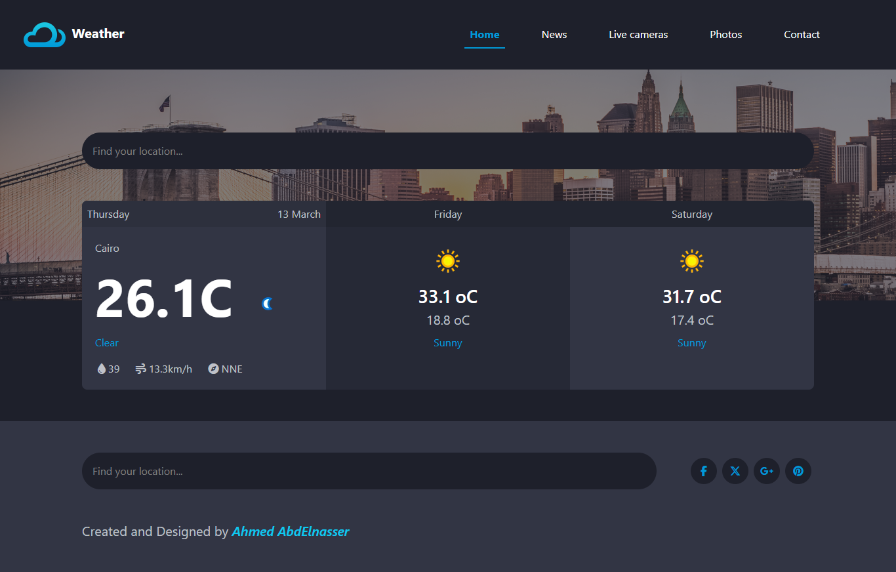

# Weather-Application
### Assignment-11 (Route)

## Table of contents

- [Overview](#overview)
  - [Links](#links)
  - [Built with](#built-with)
  - [What I learned](#what-i-learned)
  - [Continued development](#continued-development)

## Overview

- Application used for knowing the weather of today, tommorow, and the day after  
- Assignment for practicing API's and JS in general
- Navbar is design only there is no plans for making this project bigger

### Links

- Live Site URL: [Add live site URL here](https://abdelnasser77.github.io/Weather-Application/)

### Built with

- Semantic HTML5 markup
- CSS Variables
- Flexbox
- CSS Grid
- [WeatherAPI](https://www.weatherapi.com/) - WeatherAPI
- [Bootstrap](https://getbootstrap.com/) - Bootstrap

### What I learned

Practiced more of bootstrap and made it responsive using the bootstrap grid
definitely need more practice and recape bootstrap 
i am better at js and i think i am generally good at it but i always keep thinking of better and cleaner code which is sometimes frustrating

Learnt AJAX and APIs and the API Base URL and passing parameters to it

### Continued development

- Console keeps on outputing errors when entering a location due to onInput event and passing the value to the API URL directly
maybe i will look into it and refactor the code to make it cleaner
- geolocation API for displaying the Weather based on the location of the user when first loading up the APP
